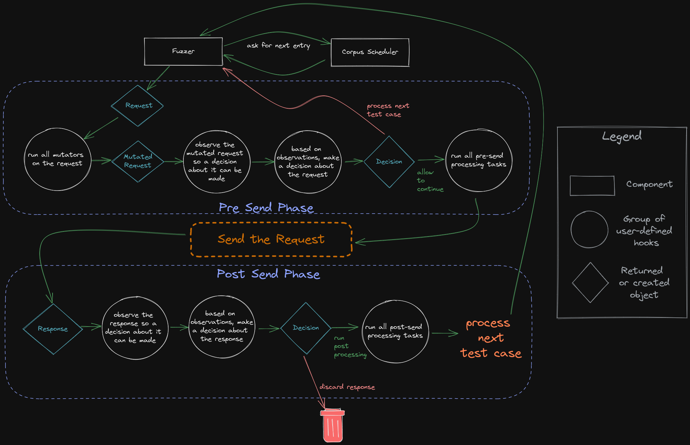
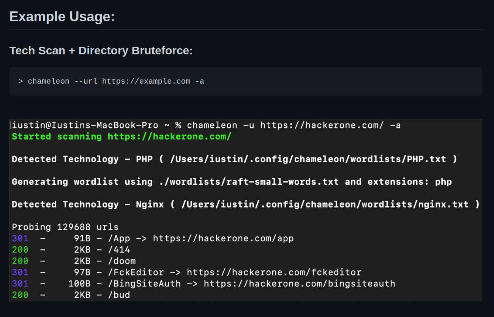

<h1 align="center">
  <br>
  <!-- <a href="https://github.com/epi052/feroxfuzz"></a> -->
  🚀 FeroxFuzz 🚀
  <br>
</h1>

<h4 align="center">A structure-aware HTTP fuzzing library</h4>

<p align="center">
  <a href="https://github.com/epi052/feroxfuzz/actions?query=workflow%3A%22CI+Pipeline%22">
    
  </a>

  <a href="https://github.com/epi052/feroxfuzz/commits/master">
    
  </a>
  
  <a href="https://codecov.io/gh/epi052/feroxfuzz">
    
  </a>

  <a href="https://crates.io/crates/feroxfuzz">
    
  </a>

  <a href="https://crates.io/crates/feroxfuzz">
    
  </a>
  
  <!-- ALL-CONTRIBUTORS-BADGE:START - Do not remove or modify this section 
    [](#contributors-)
  <!-- ALL-CONTRIBUTORS-BADGE:END -->

  <a href="https://github.com/epi052/feroxfuzz/graphs/contributors">
    
  </a>
</p>

---

## 🤔 Another ferox? why? 🤔

Chill, it's not another command-line tool, this one's a library! 😁

More specifically, FeroxFuzz is a structure-aware HTTP fuzzing library.

The primary goal in writing FeroxFuzz was to move some core pieces out of [feroxbuster](https://github.com/epi052/feroxbuster) and into a place where they could be generally useful for other folks. In so doing, my hope is that anyone who wants to write web tooling and/or one-off web fuzzers in Rust, can do so with minimal effort.  

## Design 

FeroxFuzz's overall design is derived from [LibAFL](https://github.com/AFLplusplus/LibAFL). FeroxFuzz implements most of the components listed in [LibAFL: A Framework to Build Modular and Reusable Fuzzers (pre-print)](https://www.s3.eurecom.fr/docs/ccs22_fioraldi.pdf). When FeroxFuzz deviates, it's typically due to supporting async code.

Similar to LibAFL, FeroxFuzz is a composable fuzzing library. However, unlike LibAFL, FeroxFuzz is solely focused on **black box HTTP fuzzing**.

## Fuzz-loop execution flow

Below is a visual depiction of the different components, hooks, and control flow employed by FeroxFuzz.



## 🚧 Warning: Under Construction 🚧

FeroxFuzz is very capable, and was made to suit all of my planned needs for a new `feroxbuster`. However, I still expect FeroxFuzz's API to change, at least slightly, as work on the new version of `feroxbuster` begins.

Until the API solidifies, breaking changes ~~may~~ will occur.

## Getting Started

The easiest way to get started is to include FeroxFuzz in your project's `Cargo.toml`. 

```toml
[dependencies]
feroxfuzz = { version = "1.0.0-rc.11" }
```

## Docs

In addition to the `examples/` folder, the API docs have extensive documentation of components along with examples of their use.

- [FeroxFuzz API Docs](https://docs.rs/feroxfuzz/latest/feroxfuzz/): FeroxFuzz's API docs, which are automatically generated from the doc comments in this repo.
- [Official Examples](https://github.com/epi052/feroxfuzz/tree/main/examples): FeroxFuzz's dedicated, runnable examples, which are great for digging into specific concepts and are heavily commented.

## Example

The example below ([examples/async-simple.rs](https://github.com/epi052/feroxfuzz/blob/main/examples/async-simple.rs)) shows the bare minimum to write a fuzzer using FeroxFuzz.

If using the source, the example can be run from the `feroxfuzz/` directory using the following command:

> note: unless you have a webserver running on your machine @ port 8000, you'll need to change the target passed in `Request::from_url`

```
cargo run --example async-simple
```

```rust
#[tokio::main]
async fn main() -> Result<(), Box<dyn std::error::Error>> {
    // create a new corpus from the given list of words
    let words = Wordlist::from_file("./examples/words")?
        .name("words")
        .build();

    // pass the corpus to the state object, which will be shared between all of the fuzzers and processors
    let mut state = SharedState::with_corpus(words);

    // bring-your-own client, this example uses the reqwest library
    let req_client = reqwest::Client::builder().build()?;

    // with some client that can handle the actual http request/response stuff
    // we can build a feroxfuzz client, specifically an asynchronous client in this
    // instance.
    //
    // feroxfuzz provides both a blocking and an asynchronous client implementation
    // using reqwest. 
    let client = AsyncClient::with_client(req_client);

    // ReplaceKeyword mutators operate similar to how ffuf/wfuzz work, in that they'll
    // put the current corpus item wherever the keyword is found, as long as its found
    // in data marked fuzzable (see ShouldFuzz directives below)
    let mutator = ReplaceKeyword::new(&"FUZZ", "words");

    // fuzz directives control which parts of the request should be fuzzed
    // anything not marked fuzzable is considered to be static and won't be mutated
    //
    // ShouldFuzz directives map to the various components of an HTTP request
    let request = Request::from_url(
        "http://localhost:8000/?admin=FUZZ",
        Some(&[ShouldFuzz::URLParameterValues]),
    )?;

    // a `StatusCodeDecider` provides a way to inspect each response's status code and decide upon some Action
    // based on the result of whatever comparison function (closure) is passed to the StatusCodeDecider's
    // constructor
    //
    // in plain english, the `StatusCodeDecider` below will check to see if the request's http response code
    // received is equal to 200/OK. If the response code is 200, then the decider will recommend the `Keep`
    // action be performed. If the response code is anything other than 200, then the recommendation will
    // be to `Discard` the response.
    //
    // `Keep`ing the response means that the response will be allowed to continue on for further processing
    // later in the fuzz loop.
    let decider = StatusCodeDecider::new(200, |status, observed, _state| {
        if status == observed {
            Action::Keep
        } else {
            Action::Discard
        }
    });

    // a `ResponseObserver` is responsible for gathering information from each response and providing
    // that information to later fuzzing components, like Processors. It knows things like the response's
    // status code, content length, the time it took to receive the response, and a bunch of other stuff.
    let response_observer: ResponseObserver<AsyncResponse> = ResponseObserver::new();

    // a `ResponseProcessor` provides access to the fuzzer's instance of `ResponseObserver`
    // as well as the `Action` returned from calling `Deciders` (like the `StatusCodeDecider` above).
    // Those two objects may be used to produce side-effects, such as printing, logging, calling out to
    // some other service, or whatever else you can think of.
    let response_printer = ResponseProcessor::new(
        |response_observer: &ResponseObserver<AsyncResponse>, action, _state| {
            if let Some(Action::Keep) = action {
                println!(
                    "[{}] {} - {} - {:?}",
                    response_observer.status_code(),
                    response_observer.content_length(),
                    response_observer.url(),
                    response_observer.elapsed()
                );
            }
        },
    );

    // `Scheduler`s manage how the fuzzer gets entries from the corpus. The `OrderedScheduler` provides
    // in-order access of the associated `Corpus` (`Wordlist` in this example's case)
    let scheduler = OrderedScheduler::new(state.clone())?;

    // the macro calls below are essentially boilerplate. Whatever observers, deciders, mutators,
    // and processors you want to use, you simply pass them to the appropriate macro call and
    // eventually to the Fuzzer constructor.
    let deciders = build_deciders!(decider);
    let mutators = build_mutators!(mutator);
    let observers = build_observers!(response_observer);
    let processors = build_processors!(response_printer);

    let threads = 40;  // number of threads to use for the fuzzing process

    // the `Fuzzer` is the main component of the feroxfuzz library. It wraps most of the other components 
    // and takes care of the actual fuzzing process.
    let mut fuzzer = AsyncFuzzer::new(threads)
        .client(client)
        .request(request)
        .scheduler(scheduler)
        .mutators(mutators)
        .observers(observers)
        .processors(processors)
        .deciders(deciders)
        .post_loop_hook(|state| {
            // this closure is called after each fuzzing loop iteration completes.
            // it's a good place to do things like print out stats
            // or do other things that you want to happen after each
            // full iteration over the corpus
            println!("\n•*´¨`*•.¸¸.•* Finished fuzzing loop •*´¨`*•.¸¸.•*\n");
            println!("{state:#}");
        })
        .build();

    // the fuzzer will run until it iterates over the entire corpus once
    fuzzer.fuzz_once(&mut state).await?;

    println!("{state:#}");

    Ok(())
}
```

The fuzzer above would produce something similar to what's shown below.

```
[200] 815 - http://localhost:8000/?admin=Ajax - 840.985µs
[200] 206 - http://localhost:8000/?admin=Al - 4.092037ms
----8<----
SharedState::{
  Seed=24301
  Rng=RomuDuoJrRand { x_state: 97704, y_state: 403063 }
  Corpus[words]=Wordlist::{len=102774, top-3=[Static("A"), Static("A's"), Static("AMD")]},
  Statistics={"timeouts":0,"requests":102774.0,"errors":44208,"informatives":3626,"successes":29231,"redirects":25709,"client_errors":18195,"server_errors":26013,"redirection_errors":0,"connection_errors":0,"request_errors":0,"start_time":{"secs":1662124648,"nanos":810398280},"avg_reqs_per_sec":5946.646301595066,"statuses":{"500":14890,"201":3641,"307":3656,"203":3562,"101":3626,"401":3625,"207":3711,"308":3578,"300":3724,"404":3705,"301":3707,"302":3651,"304":3706,"502":3682,"402":3636,"200":3718,"503":3762,"400":3585,"501":3679,"202":3659,"205":3680,"206":3676,"204":3584,"403":3644,"303":3687}}
}
```

## 🤓 Projects using FeroxFuzz 🤓

<table>
  <tr>
    <td align="center"><a href="https://github.com/iustin24/chameleon"><br /><sub><b>chameleon</b></sub></a><br /></td>
  </tr>
</table>


## Contributors ✨

Thanks goes to these wonderful people ([emoji key](https://allcontributors.org/docs/en/emoji-key)):

<!-- ALL-CONTRIBUTORS-LIST:START - Do not remove or modify this section -->
<!-- prettier-ignore-start -->
<!-- markdownlint-disable -->
<table>
  <tbody>
    <tr>
      <td align="center"><a href="https://github.com/iustin24"><br /><sub><b>iustin24</b></sub></a><br /><a href="https://github.com/epi052/feroxfuzz/commits?author=iustin24" title="Code">💻</a></td>
      <td align="center"><a href="https://github.com/andreademurtas"><br /><sub><b>andreademurtas</b></sub></a><br /><a href="https://github.com/epi052/feroxfuzz/commits?author=andreademurtas" title="Code">💻</a></td>
    </tr>
  </tbody>
</table>

<!-- markdownlint-restore -->
<!-- prettier-ignore-end -->

<!-- ALL-CONTRIBUTORS-LIST:END -->

This project follows the [all-contributors](https://github.com/all-contributors/all-contributors) specification. Contributions of any kind welcome!
